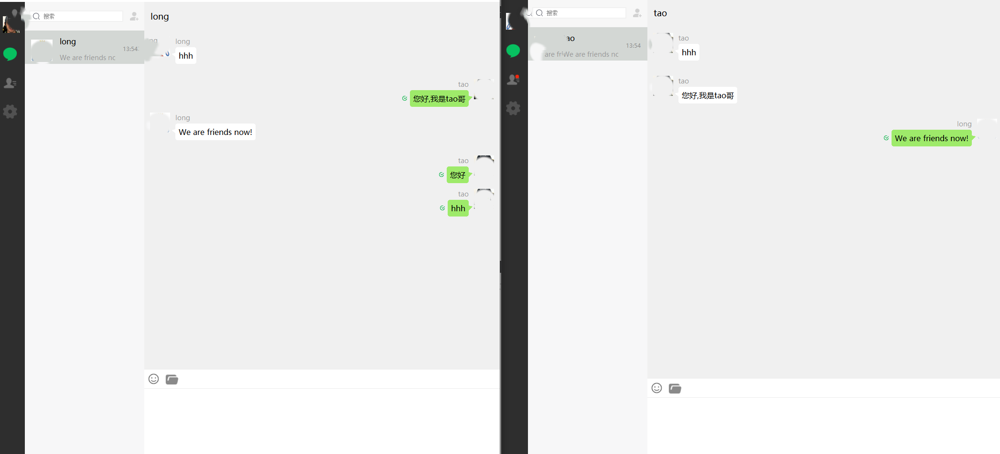

# 分布式即时通讯系统 (Distributed Instant Messaging)

## 📖 项目简介

基于 C++11 + Boost.Asio + RPC + Redis 构建的分布式聊天后端。模仿微信核心功能的分布式即时通讯服务端，支持用户注册登录、好友管理、文本/图片消息收发、跨服消息路由、文件上传下载。采用微服务架构，六个独立服务通过 RPC 协议协作。

## 效果预览



基于 Qt 的桌面客户端，支持登录注册、好友添加、文本聊天及图片消息。

## 🚀 核心架构与模块

项目划分为以下几个独立运行的微服务模块：

- **GateServer (网关服务器)**：作为客户端接入的统一入口，负责保持 TCP 长连接、请求路由、负载均衡及基础的安全过滤。

- **VarifyServer (验证服务器)**：邮件验证码服务，独立处理用户注册授权等身份验证逻辑，通过 HTTP 协议提供安全的鉴权接口。

- **ChatServer (聊天服务器)**：核心业务节点，原生 TCP 长连接 ，负责点对点单聊、群聊消息的路由、转发与持久化存储。

- **StatusServer (状态服务器)**：维护全局用户的在线/离线状态，负载均衡选择最优 ChatServer，发放登录 token，支持跨节点的高效状态同步与查询。

- **ResourceServer （资源服务器):**TCP 文件服务，图片上传/下载，异步队列写盘

## ✨ 技术特性

- **高性能网络引擎**：基于 Linux I/O 模型与 Reactor 模式，能够高效处理海量并发连接。结合多线程编程与进程间通信机制，充分压榨多核 CPU 性能。
- **持久化与缓存管理**：
  - **MySQL**：用于安全存储用户资料、好友关系及离线消息。底层配合合理的索引设计与事务处理，并进行查询优化。
  - **Redis**：利用其丰富的数据类型与持久化机制，实现高频读取的在线状态缓存、会话管理与验证信息。
- **严谨的面向对象设计**：充分利用 C++11 特性，在项目中合理应用单例模式 (Singleton)经典设计模式，保证了代码的可维护性与模块间的解耦。
- **规范的协议设计**：熟练运用 OSI 七层与 TCP/IP 四层模型知识，对底层 IP、TCP 以及应用层 HTTP 协议进行合理封装，确保消息传输的可靠性与低延迟。

## 🛠️ 技术栈

- **开发语言**：C++ / C++11
- **网络通信**：TCP/IP, HTTP, Socket, Reactor 网络模型
- **数据库 & 缓存**：MySQL, Redis
- **构建与开发工具**：CMake


## 🗺️ 快速开始

### 前置依赖

- **Visual Studio 2022** (v142 toolset) 或 CMake 3.12+
- **Boost 1.81.0** — system 组件
- **gRPC 1.x** + Protobuf
- **MySQL 8.x** — 端口 3308，schema: `wechat`
- **Redis** — 端口 6380
- **OpenSSL**
- **Node.js 18+** (VarifyServer)
- **MySQL Connector/C++** (8.2 / 9.x)
- **hiredis**
- **jsoncpp**

### 数据库初始化

导入各服务对应的 MySQL schema（含用户表、好友关系表、聊天记录表及存储过程）。

### 构建

**Visual Studio:**
打开各服务目录下的 `.sln` 文件，选择 Release x64 编译。

**CMake (ChatServer2 示例):**

```bash
cd ChatServer2 && mkdir build && cd build
cmake .. -G "Visual Studio 17 2022" -A x64
cmake --build . --config Release
```

### 启动顺序

```bash
# 1. 基础设施 / Infrastructure
redis-server --port 6380
mysqld --port 3308

# 2. 核心服务 / Core Services
cd VarifyServer && npm start              # Port 50051
cd StatusServer && StatusServer.exe       # Port 50052

# 3. 业务服务 / Business Services
cd ChatServer  && ChatServer.exe          # Port 8090 + 50055
cd ChatServer2 && ChatServer2.exe         # Port 8091 + 50056
cd ResourceServer && ResourceServer.exe   # Port 9090

# 4. 网关 / Gateway (最后启动)
cd GateServer && GateServer.exe           # Port 8080
```

### 配置

仓库不提交真实配置。部署时先将各服务目录下的 `config.example.ini`
复制为 `config.ini`，将 `VarifyServer/config.example.json` 复制为
`VarifyServer/config.json`，再填入数据库、Redis 和邮箱凭据。

> **注意：** 不要把真实 `config.ini` / `config.json` 提交到公开仓库。
